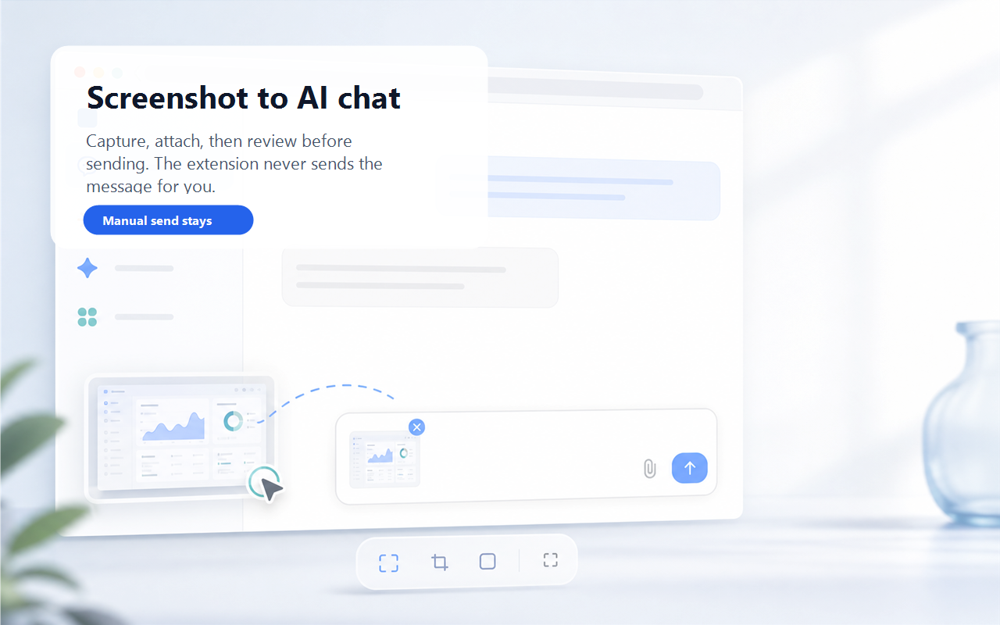

# AI Screenshot Attacher / AI 截图附加器

Manifest V3 Chrome / Edge extension MVP for attaching the current system clipboard screenshot to ChatGPT, Claude, Gemini, or Doubao. It never sends the AI message automatically.

这是一个 Manifest V3 Chrome / Edge 浏览器扩展 MVP，用于把当前系统剪贴板里的截图附加到 ChatGPT、Claude、Gemini 或豆包。插件不会自动发送 AI 消息。

Browser requirement: Chrome 109+ or a Chromium-based Microsoft Edge version compatible with Chromium 109+. The extension declares `minimum_chrome_version: 109` because clipboard access depends on the MV3 offscreen API.

浏览器要求：Chrome 109+，或兼容 Chromium 109+ 的 Microsoft Edge。插件依赖 MV3 offscreen API 访问剪贴板，因此在清单中声明了 `minimum_chrome_version: 109`。



## Who It Is For / 适合谁

- People who frequently paste screenshots into AI chats for troubleshooting, writing, product work, or visual review.
- 需要频繁把截图发给 AI 分析、排错、写作、产品讨论或视觉检查的用户。
- Users who want a faster attach workflow but still want to review the message before sending.
- 希望减少重复粘贴步骤，但仍想自己检查并发送消息的用户。

## Features / 功能

- Read a clipboard screenshot only after a shortcut, popup button, or enabled automatic mode trigger.
- 仅在快捷键、弹窗按钮，或用户主动开启自动模式后读取剪贴板截图。
- Open or activate the selected AI target tab when used manually.
- 手动使用时会打开或激活指定 AI 目标页面。
- Optional automatic mode: when enabled, detect new clipboard screenshots only while ChatGPT, Claude, Gemini, or Doubao is already open.
- 可选自动模式：开启后，仅在 ChatGPT、Claude、Gemini 或豆包已打开时检测新的剪贴板截图。
- Reuse supported AI pages opened as Chrome installed desktop app windows when Chrome exposes them to the extension.
- 支持复用 Chrome “安装为应用”的受支持 AI 桌面窗口。
- Use site-specific attachment strategies and stop after the first dispatched mutation when the page cannot confirm the result, preventing one trigger from creating duplicate attachments.
- 针对不同网站使用不同附加策略；页面无法确认结果时，会在第一次已执行的操作后停止，避免一次触发产生重复附件。
- Manual Gemini and Doubao attachment can use real clipboard paste only after restoring the captured screenshot; automatic mode always uses the captured image payload instead of later clipboard contents.
- 手动附加到 Gemini 或豆包时，仅会在恢复已捕获截图后尝试真实剪贴板粘贴；自动模式始终使用已捕获的图片数据，不会误用之后变化的剪贴板内容。
- On failure, optionally write the image back to the clipboard and, when the target composer is reachable, focus it for manual `Ctrl+V` / `Cmd+V`.
- 自动附加失败时，可选择把图片写回剪贴板；目标输入区仍可访问时，插件会尝试聚焦它，便于手动 `Ctrl+V` / `Cmd+V`。
- Adapter architecture for adding more AI sites later.
- 使用 adapter 架构，方便后续扩展更多 AI 网站。

## Privacy and Safety / 隐私与安全

- Full privacy policy: [PRIVACY.md](PRIVACY.md).
- 完整隐私政策见：[PRIVACY.md](PRIVACY.md)。
- This extension does not upload images to an extension author server.
- 本插件不会把图片上传到插件作者服务器。
- Manual mode reads the clipboard only after explicit user action.
- 手动模式只在用户明确触发后读取剪贴板。
- Automatic mode is off by default. When enabled, it checks the clipboard only while at least one supported AI page is already open in the same Chrome profile.
- 自动模式默认关闭。开启后，仅在同一 Chrome profile 中已有受支持 AI 页面打开时检测剪贴板。
- It does not automatically send AI messages.
- 插件不会自动发送 AI 消息。
- It does not read chat history.
- 插件不会读取聊天记录。
- It does not save screenshot history.
- 插件不会保存截图历史。
- The image is passed to the selected AI platform because the user explicitly chose to attach it there.
- 图片会传给用户选择的 AI 平台，这是用户主动附加图片到该平台的结果。
- Debug logs never include image binary data, base64 data, or chat content.
- 调试日志不会记录图片二进制、base64 数据或聊天内容。

## Permissions / 权限

The MVP uses only these extension permissions:

MVP 只使用以下扩展权限：

- `activeTab`
- `tabs`
- `scripting`
- `storage`
- `clipboardRead`
- `clipboardWrite`
- `offscreen`

Host permissions are limited to:

站点权限仅限：

- `https://chatgpt.com/*`
- `https://claude.ai/*`
- `https://gemini.google.com/*`
- `https://doubao.com/*`
- `https://www.doubao.com/*`

No `<all_urls>` permission is required. Clipboard access is handled through an MV3 offscreen document because service workers do not have DOM clipboard access.

本插件不需要 `<all_urls>` 权限。剪贴板访问通过 MV3 offscreen document 完成，因为 service worker 没有 DOM 剪贴板访问能力。

## Install Dependencies / 安装依赖

```bash
npm install
```

## Build / 构建

```bash
npm run build
```

The unpacked extension output is generated in `dist/`.

构建后的可加载扩展目录会生成在 `dist/`。

## Development / 开发

Use Node 24 or newer, then install dependencies with:

使用 Node 24 或更新版本，然后安装依赖：

```bash
npm ci
```

Run the full local quality gate before opening a pull request:

提交 PR 前运行完整本地质量门禁：

```bash
npm run verify
```

This runs type checking, ESLint, Prettier checks, Vitest, and the production build.

该命令会运行类型检查、ESLint、Prettier 检查、Vitest 和生产构建。

Create a loadable extension zip with:

生成可加载的扩展压缩包：

```bash
npm run package
```

The command rebuilds `dist/`, validates the extension resource closure and JavaScript syntax, then writes the zip to `release/`.

该命令会重新构建 `dist/`、验证扩展资源闭包与 JavaScript 语法，然后把压缩包生成到 `release/`。

For public release preparation, use:

公开发布前请使用：

- [Release checklist](docs/release-checklist.md)
- [Chrome Web Store listing notes](docs/chrome-web-store-listing.md)
- [Manual test matrix](docs/manual-test-matrix.md)

## Load in Chrome / 在 Chrome 中加载

1. Open `chrome://extensions`.
2. Enable Developer mode.
3. Click Load unpacked.
4. Select the `dist/` folder.

5. 打开 `chrome://extensions`。
6. 开启开发者模式。
7. 点击“加载已解压的扩展程序”。
8. 选择 `dist/` 文件夹。

## Load in Microsoft Edge / 在 Microsoft Edge 中加载

1. Open `edge://extensions`.
2. Enable Developer mode.
3. Click Load unpacked.
4. Select the `dist/` folder.

5. 打开 `edge://extensions`。
6. 开启开发者模式。
7. 点击“加载已解压的扩展程序”。
8. 选择 `dist/` 文件夹。

## Shortcuts / 快捷键

Default commands:

默认命令：

- `Alt+Shift+A`: attach to the default model/platform selected in settings. / 附加到设置中选择的默认模型/平台。
- `Alt+Shift+1`: attach to ChatGPT. / 附加到 ChatGPT。
- `Alt+Shift+2`: attach to Claude. / 附加到 Claude。
- `Alt+Shift+3`: attach to Gemini. / 附加到 Gemini。
- Doubao has no default shortcut because Chrome allows only 4 default command shortcuts per extension. Use the popup button, set Doubao as the default model, or free another shortcut in the browser shortcuts page and assign one manually. / 豆包没有默认快捷键，因为 Chrome 每个扩展最多允许 4 个默认命令快捷键。可使用 popup 按钮、把豆包设为默认模型，或在浏览器快捷键页面释放其他快捷键后手动分配。

If a shortcut is already used by the browser or OS, change it at `chrome://extensions/shortcuts` or `edge://extensions/shortcuts`.

如果快捷键被浏览器或系统占用，可以在 `chrome://extensions/shortcuts` 或 `edge://extensions/shortcuts` 修改。

## Test Checklist / 测试清单

1. Use `Win+Shift+S` and copy a screenshot to the clipboard.
2. Press `Alt+Shift+1`.
3. Confirm ChatGPT opens or activates.
4. Confirm the screenshot appears in the input attachment area.
5. Confirm no message is sent automatically.
6. Repeat with `Alt+Shift+2` for Claude.
7. Repeat with `Alt+Shift+3` for Gemini.
8. Repeat with the popup Doubao button or set Doubao as the default model and press `Alt+Shift+A`.
9. Clear the clipboard or copy text only, then trigger the extension.
10. Confirm the popup shows `未检测到剪贴板图片，请先截图后再试。`
11. If automatic attachment fails, confirm the screenshot remains available for manual paste and that the input is focused when the target composer was reachable.

12. 使用 `Win+Shift+S` 截图，并确保截图进入剪贴板。
13. 按 `Alt+Shift+1`。
14. 确认 ChatGPT 打开或被激活。
15. 确认截图出现在输入框附件区。
16. 确认插件不会自动发送消息。
17. 使用 `Alt+Shift+2` 测试 Claude。
18. 使用 `Alt+Shift+3` 测试 Gemini。
19. 使用 popup 里的豆包按钮测试，或把豆包设为默认模型后按 `Alt+Shift+A`。
20. 清空剪贴板或只复制文本，再触发插件。
21. 确认 popup 显示 `未检测到剪贴板图片，请先截图后再试。`
22. 如果自动附加失败，确认截图仍可手动粘贴；目标输入区可访问时，再确认输入框已被聚焦。

## Automatic Mode / 自动模式

Automatic mode is disabled by default. Enable it from the options page.

自动模式默认关闭，需要在设置页手动开启。

When enabled:

开启后：

- If ChatGPT, Claude, Gemini, or Doubao is already open, the extension starts a local offscreen clipboard monitor.
- 如果 ChatGPT、Claude、Gemini 或豆包已打开，插件会启动本地 offscreen 剪贴板监控。
- The monitor records the current clipboard image fingerprint on startup and does not attach that old image.
- 启动时只记录当前剪贴板图片指纹，不会把旧图片立刻附加上去。
- It checks for new clipboard images about once per second. Unchanged clipboard contents are compared cheaply and are not re-processed.
- 约每 1 秒检测一次新的剪贴板图片；剪贴板内容未变化时只做轻量比较，不会重复处理图片。
- New images are attached to the currently focused AI page first.
- 新图片会优先附加到当前聚焦的 AI 页面。
- Attachment work is serialized per target tab, so a manual shortcut and automatic detection cannot mutate the same composer concurrently.
- 同一目标标签页的附加操作会串行执行，避免手动快捷键与自动检测同时修改同一个输入区。
- Manual Gemini/Doubao operations that prepare and paste through the system clipboard are also serialized globally across tabs. Extension-originated clipboard writes are treated as monitor baselines instead of new automatic screenshots.
- 手动 Gemini/豆包的“准备剪贴板→浏览器粘贴”操作还会在所有标签页间全局串行；插件自身写入的图片会成为监控基线，不会再次被当作新的自动截图。
- If no supported AI page is open, the monitor stops and no clipboard reads are attempted.
- 如果没有受支持的 AI 页面打开，监控会停止，不会尝试读取剪贴板。
- Clicking the extension button still keeps the original behavior: it opens the selected default model/platform if needed.
- 点击插件按钮仍保留原行为：必要时自动打开所选默认模型/平台页面。

## Troubleshooting / 故障排查

- If nothing appears to happen after a shortcut, open the extension popup. The latest operation result is shown there, and the extension icon badge shows `OK` or `!`.
- 如果快捷键后没有反应，打开插件 popup 查看最近一次结果，扩展图标也会显示 `OK` 或 `!`。
- If shortcuts do not fire, check `chrome://extensions/shortcuts`. Some systems reserve `Alt+Shift` combinations.
- 如果快捷键没有触发，检查 `chrome://extensions/shortcuts`。部分系统会占用 `Alt+Shift` 组合。
- If the result says no clipboard image, take a fresh screenshot with `Win+Shift+S` and make sure it is copied, not only saved to disk.
- 如果提示没有剪贴板图片，请重新用 `Win+Shift+S` 截图，并确认截图是复制到剪贴板，而不是只保存到磁盘。
- If clipboard permission fails, reload the extension from `chrome://extensions`, then try the popup button once.
- 如果剪贴板权限失败，从 `chrome://extensions` 重新加载扩展，然后先用 popup 按钮测试一次。
- If automatic attachment fails, the target site's frontend may have rejected synthetic paste/drop. The extension should focus the input and keep the screenshot available for manual `Ctrl+V`.
- 如果自动附加失败，可能是目标网站前端拒绝了合成 paste/drop。插件会尝试聚焦输入框，并保留截图供手动 `Ctrl+V`。
- If the result says the attachment action could not be confirmed, inspect the composer first. Paste manually only when no image is present, which avoids duplicating an attachment that rendered slowly.
- 如果提示“未能确认结果”，请先检查输入区；只有确认没有图片时再手动粘贴，避免慢速渲染造成重复附件。
- If a supported AI site is installed as a Chrome desktop app, keep it in the same Chrome profile where this extension is installed.
- 如果受支持 AI 站点是 Chrome 桌面应用，请确保它和插件安装在同一个 Chrome profile 中。

## FAQ / 常见问题

**Does it send my message automatically? / 它会自动发送消息吗？**

No. It only attaches the screenshot. You still write, review, and send the message yourself.

不会。它只附加截图，消息仍由你自己编写、检查和发送。

**Does it save my screenshots? / 它会保存我的截图吗？**

No screenshot history is stored by the extension.

不会。插件不保存截图历史。

**Why does it need clipboard permissions? / 为什么需要剪贴板权限？**

`clipboardRead` is required to read the screenshot you just copied. For a manual Gemini or Doubao action, `clipboardWrite` may prepare that captured image immediately before a browser paste so later clipboard changes cannot substitute a different image. It is also used by the optional failure fallback that keeps the screenshot available for manual paste. Automatic mode attaches the captured payload without using the current clipboard for a real paste.

`clipboardRead` 用于读取你刚复制的截图。手动附加到 Gemini 或豆包时，`clipboardWrite` 可能会在浏览器粘贴前把本次捕获的图片准备到剪贴板，避免之后的剪贴板变化替换成另一张图；它也用于可选的失败回退，方便你手动粘贴。自动模式直接使用已捕获的图片数据，不会用当前剪贴板执行真实粘贴。

**Where do I report a broken AI-site adapter? / 某个 AI 网站失效了去哪里反馈？**

Open an issue with the target site, browser, extension version, and what happened: https://github.com/lhwen686/ai-screenshot-attacher/issues/new/choose

请提交 issue，并说明目标网站、浏览器、插件版本和失败现象：https://github.com/lhwen686/ai-screenshot-attacher/issues/new/choose

## Settings / 设置项

Open the extension options page to change:

打开扩展设置页可以修改：

- Default model/platform: choose ChatGPT, Claude, Gemini, or Doubao for `Alt+Shift+A` and the popup primary button. This does not choose a model version inside those sites. / 默认模型/平台：为 `Alt+Shift+A` 和 popup 主按钮选择 ChatGPT、Claude、Gemini 或豆包。这不会选择站点内部的具体模型版本。
- Whether to show a page toast after attachment success or failure. / 附加成功或失败后是否显示页面 Toast。
- Whether to enable automatic paste mode. / 是否启用自动粘贴模式。
- Whether to write the image back to the clipboard on failure. / 失败时是否写回剪贴板。
- Whether to open a target AI page in a new tab if none is already open. / 没有目标页面时是否新建标签页打开。
- Whether to enable debug logs. / 是否启用调试日志。

## Known Limits / 已知限制

- AI sites frequently change their frontends. The adapters use multiple scoped selector fallbacks to reduce reliance on fragile class names, but selectors and success heuristics may still need updates.
- AI 网站前端变化频繁。adapter 已避免依赖固定 className，但 selector 和成功检测逻辑仍可能需要更新。
- Some sites may block synthetic paste or drop events. In that case the extension preserves the screenshot in the clipboard and focuses the input when the target composer is still reachable.
- 一些网站可能阻止合成 paste 或 drop 事件。此时插件会保留剪贴板截图，并在目标输入区仍可访问时尝试聚焦输入框。
- The browser may require clipboard permission before `navigator.clipboard.read()` works.
- 浏览器可能要求授予剪贴板权限后，`navigator.clipboard.read()` 才能工作。
- Automatic mode does not open AI pages. It only attaches to already open ChatGPT, Claude, Gemini, or Doubao pages.
- 自动模式不会打开 AI 页面，只会附加到已经打开的 ChatGPT、Claude、Gemini 或豆包。
- The extension does not bypass login, account checks, cookies, or site upload limits.
- 插件不会绕过登录、账号检查、Cookie 或网站上传限制。

## Add a New Adapter / 新增 Adapter

1. Add a new target id in `src/shared/constants.ts`.
2. Create `src/adapters/newTarget.ts`.
3. Implement `AiTargetAdapter` with `detect`, `waitUntilReady`, `attachImage`, and optional `focusInput`.
4. Add selector candidates for file inputs, text inputs, drop targets, and attachment previews.
5. Register the adapter in `src/adapters/registry.ts`.
6. Add popup/options labels if needed.
7. Run `npm run build` and manually test the target site.

8. 在 `src/shared/constants.ts` 中新增目标 id。
9. 创建 `src/adapters/newTarget.ts`。
10. 实现 `AiTargetAdapter`，包括 `detect`、`waitUntilReady`、`attachImage`，以及可选的 `focusInput`。
11. 添加文件输入框、文本输入框、拖放区域、附件预览的候选 selector。
12. 在 `src/adapters/registry.ts` 中注册 adapter。
13. 如有需要，补充 popup/options 显示标签。
14. 运行 `npm run build`，并手动测试目标站点。

## Reference / 参考

The MV3 offscreen document approach follows Chrome's official offscreen document guidance:

MV3 offscreen document 方案参考 Chrome 官方文档：

https://developer.chrome.com/docs/extensions/reference/offscreen
